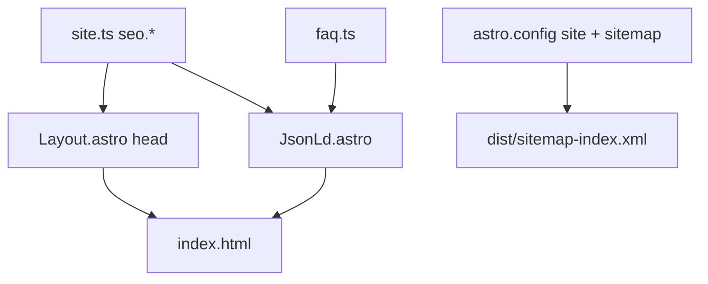

# SEO — iceking.guru

This document describes how search engines and social networks see the site, where to change settings, and how to verify after deploy.

**Production URL:** https://iceking.guru/

---

## Overview

The site is a **single static page** (`src/pages/index.astro`). SEO is handled at build time:

| Layer | Mechanism |
|-------|-----------|
| Crawling | `public/robots.txt` + generated sitemap |
| HTML meta | `src/layouts/Layout.astro` |
| Social previews | Open Graph + Twitter Card tags |
| Structured data | `src/components/seo/JsonLd.astro` |
| On-page | One `h1`, section `h2`s, FAQ `h3`s, image `alt` text |
| Local signals | NAP block in footer (`SiteFooter.astro`) |



---

## Configuration (`src/content/site.ts`)

Primary SEO fields live under `site.seo`:

| Field | Used for |
|-------|----------|
| `title` | `<title>`, `og:title`, `twitter:title` |
| `description` | meta description, OG/Twitter description, JSON-LD `LocalBusiness.description` |
| `ogImage` | Filename under `public/assets/` → absolute `og:image` / `twitter:image` |
| `ogImageAlt` | `og:image:alt` |
| `themeColor` | `meta name="theme-color"` |

Defaults in Layout:

```astro
title = site.seo.title
description = site.seo.description
```

Override per page by passing props to `<Layout>` (optional).

**Also used in schema (not only `seo.*`):**

- `site.name`, `site.location`, `site.phoneTel`, `site.email`
- `site.social.*` → `sameAs` in LocalBusiness (HTTP links only, no `mailto:`)

**Helpers:**

- `asset(path)` — path with Astro `base` (e.g. `/assets/...`)
- `absoluteAsset(path, siteOrigin)` — full URL for OG and JSON-LD (`new URL(asset(...), Astro.site)`)

---

## `Layout.astro` — document head

File: [`src/layouts/Layout.astro`](../src/layouts/Layout.astro)

Emitted tags include:

- `charset`, `viewport`
- `meta description`, `meta robots` (`index, follow`)
- `link rel="canonical"` (from `Astro.site` + pathname)
- Open Graph: `title`, `description`, `url`, `type`, `locale`, `site_name`, `image`, `image:alt`
- Twitter: `card` (`summary_large_image`), `title`, `description`, `image`
- `theme-color`
- Favicon + `apple-touch-icon`
- Preload for header logo
- `<JsonLd />` (two JSON-LD scripts)

`meta generator` (Astro) is **not** output.

### Canonical and `astro.config.mjs`

```js
site: 'https://iceking.guru',
base: process.env.ASTRO_BASE ?? '/',
```

- **Custom domain:** `ASTRO_BASE=/` (CI default).
- **Wrong base** breaks asset URLs and can produce wrong canonical paths — keep CI on `/` for iceking.guru.

---

## Structured data (`JsonLd.astro`)

File: [`src/components/seo/JsonLd.astro`](../src/components/seo/JsonLd.astro)

### 1. LocalBusiness

- Name, description, URL (homepage canonical)
- Telephone: `+972` + `phoneTel` without leading `0`
- Email, image (same as OG image URL)
- Address: locality `חיפה`, country `IL` (no street in content)
- `sameAs`: TikTok, Instagram, Facebook

### 2. FAQPage

Built from [`src/content/faq.ts`](../src/content/faq.ts): each item → `Question` + `Answer`.

**Important:** FAQ text in `faq.ts` should match visible FAQ in [`FaqAccordion.tsx`](../src/components/react/FaqAccordion.tsx). Questions are rendered as `<h3>` under section `<h2>`.

Validate after changes:

- [Google Rich Results Test](https://search.google.com/test/rich-results)

---

## Sitemap & robots

### Sitemap

- Package: `@astrojs/sitemap` in [`astro.config.mjs`](../astro.config.mjs)
- On `npm run build`, generates:
  - `dist/sitemap-index.xml`
  - `dist/sitemap-0.xml` (homepage)

Requires `site` in Astro config (already set).

### robots.txt

File: [`public/robots.txt`](../public/robots.txt)

```
User-agent: *
Allow: /
Sitemap: https://iceking.guru/sitemap-index.xml
```

If the domain ever changes, update the `Sitemap:` line to match.

---

## Images & accessibility (SEO-related)

### Carousel / lightbox

[`src/lib/image-alt.ts`](../src/lib/image-alt.ts):

| Kind | Function | Example pattern |
|------|----------|-----------------|
| Testimonials | `testimonialAlt(i)` | `לקוח מרוצה N – Ice King אמבטיית קרח` |
| Gallery | `galleryAlt(i)` | `תמונה N – Ice King אמבטיית קרח בחיפה` |

Used in `ImageCarousel` (`altKind`), `GalleryCarousel`, and `ImageLightbox` (`getAlt`).

### Other images

- Hero, about, services, promo: explicit `alt` in Astro sections
- Loader: `alt={site.name}`

Avoid empty `alt=""` on content images (decorative-only exception).

### Open Graph image

Current default: `promo-course.png` (wide banner, better for link previews than round hero art).

To change:

1. Add image to `public/assets/`
2. Update `site.seo.ogImage` and `ogImageAlt`
3. Rebuild and re-scrape in [Facebook Sharing Debugger](https://developers.facebook.com/tools/debug/)

Ideal share image: **1200×630 px**, &lt; 8 MB, JPG/PNG (optional future asset).

---

## On-page hierarchy

| Level | Source |
|-------|--------|
| `h1` | Hero headline — [`sections.ts`](../src/content/sections.ts) `intro.headline` |
| `h2` | Section titles (testimonials, about, services, FAQ, gallery, contact) |
| `h3` | FAQ questions in accordion |

Main visible headline for users is the hero `h1`; `<title>` is shorter and keyword-focused (`אמבטיות קרח בחיפה | Ice King`) — intentional split.

---

## Footer NAP (local SEO)

[`SiteFooter.astro`](../src/components/sections/SiteFooter.astro) includes plain-text:

- Brand + service type (Hebrew)
- City, Israel
- Phone (`tel:`) + WhatsApp link
- Email (`mailto:`)

Keeps contact info in HTML for crawlers, not only in buttons.

---

## Post-deploy checklist

1. **Homepage**
   - `curl -sI https://iceking.guru/` → `200`
   - View source: one canonical, absolute `og:image`, two `application/ld+json` blocks

2. **Sitemap**
   - `curl -sI https://iceking.guru/sitemap-index.xml` → `200`
   - Index references `sitemap-0.xml` with homepage URL

3. **robots**
   - `https://iceking.guru/robots.txt` → allows `/`, correct sitemap URL

4. **Rich results**
   - [Rich Results Test](https://search.google.com/test/rich-results) — FAQ + Local Business

5. **Social**
   - [Sharing Debugger](https://developers.facebook.com/tools/debug/) — image, title, description

6. **Search Console** (manual, outside repo)
   - Add property `https://iceking.guru`
   - Submit sitemap URL
   - Request indexing after major content/SEO changes

---

## Common edits

| Goal | Action |
|------|--------|
| Change Google title/description | Edit `site.seo` in `site.ts`, rebuild, deploy |
| Change share preview image | `seo.ogImage` + file in `public/assets/` |
| Add/remove FAQ rich result | Edit `faq.ts` (+ accordion UI), rebuild |
| Update phone or city in schema | `site.ts` + footer if needed |
| New gallery images | `media.ts` + `import-media.mjs`; alts auto-indexed |

---

## Out of scope (this repo)

- Google Search Console / Analytics setup
- Dedicated `og-image.jpg` 1200×630 design file
- Multi-page routes (`/services`, blog, etc.)
- `hreflang` (single Hebrew locale)
- Automated Lighthouse CI

These can be added later without changing the current architecture.
